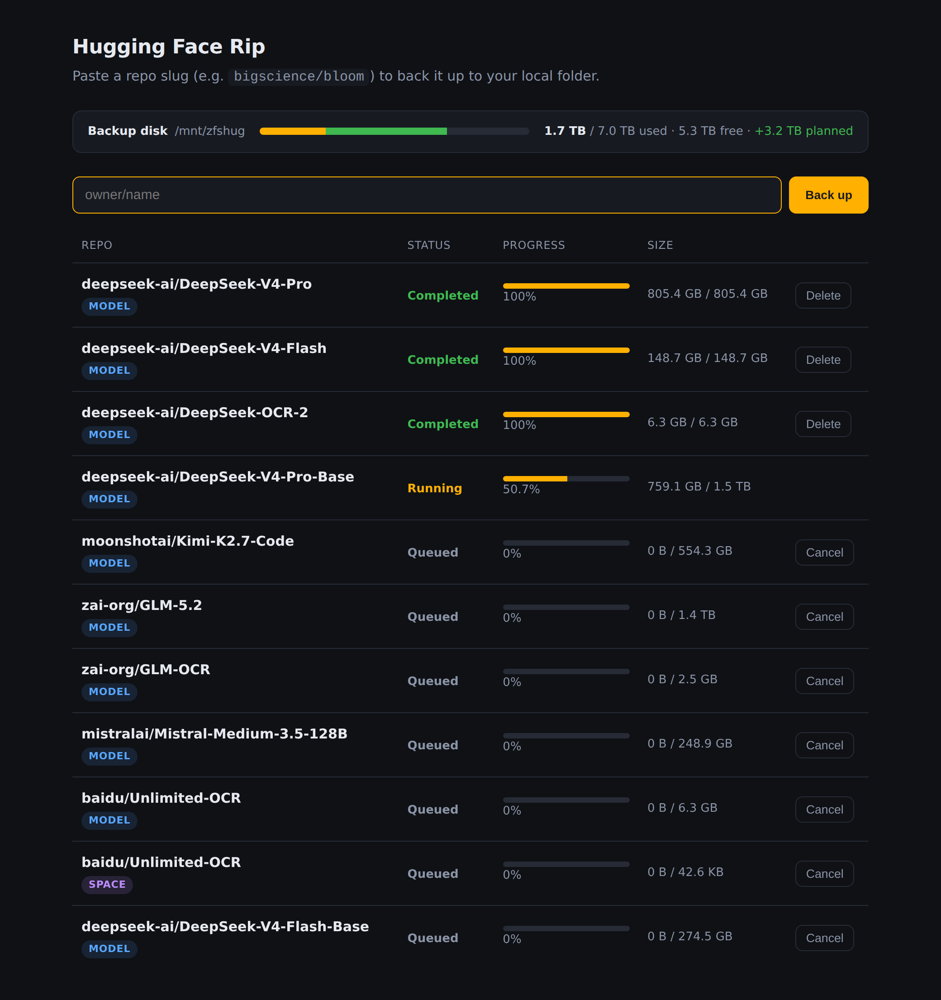

# Hugging Face Rip

A small FastAPI web app that backs up entire Hugging Face Hub repositories
(models, datasets, spaces) to a local folder — with bounded concurrency,
live progress, and automatic resume.



## Setup

1. Install dependencies (use the venv interpreter — there is no system `python`):
   ```bash
   .venv/bin/python -m pip install -r requirements.txt
   ```
2. Create your `.env` from the template and add your Hugging Face token:
   ```bash
   cp .env.example .env
   ```
   See [Configuration](#configuration) below for what each setting does.

## Configuration

All settings are environment variables, read at startup from a `.env` file in
the working directory (via `python-dotenv`) and/or the real environment. For the
systemd service they're set in the unit file instead (see below). `.env.example`
is a documented template — copy it to `.env` to start.

| Variable | Required | Default | Description |
|----------|----------|---------|-------------|
| `HUGGINGFACE_ACCESS_KEY` | **yes** | — | HF access token ([create one](https://huggingface.co/settings/tokens)). Needs read access to the repos you back up; required even for public repos. |
| `BACKUP_DIR` | **yes** | — | Where backups are written. Created if missing, must be writable. Each repo lands in `BACKUP_DIR/<repo_type>s/<owner>/<name>`. |
| `MAX_CONCURRENT_JOBS` | no | `2` | How many repos download at once. |
| `MAX_WORKERS` | no | `8` | How many files download in parallel within each repo. |
| `DB_PATH` | no | `jobs.db` | SQLite job-database path (the queue + progress). |
| `HOST` | no | `0.0.0.0` | Bind address. `0.0.0.0` exposes the dashboard to the network; use `127.0.0.1` for this machine only. |
| `PORT` | no | `8000` | Bind port. |

> **Memory:** peak RAM scales with `MAX_CONCURRENT_JOBS` × `MAX_WORKERS` (repos
> in parallel × files per repo), so lower both on a small host. The Xet
> downloader matters even more — see [Tuning for memory](#tuning-for-memory-the-xet-gotcha).

## Run

The simplest way binds to all interfaces (`0.0.0.0:8000`) by default:

```bash
.venv/bin/python -m app.main
```

Override the bind address with the `HOST` / `PORT` environment variables:

```bash
HOST=127.0.0.1 PORT=9000 .venv/bin/python -m app.main
```

Or run via uvicorn directly (e.g. with autoreload during development):

```bash
.venv/bin/uvicorn app.main:build_default_app --factory --host 0.0.0.0 --port 8000 --reload
```

Open the dashboard (e.g. http://127.0.0.1:8000, or `http://<this-host-ip>:8000`
from another machine) and paste a repo slug (e.g. `bigscience/bloom`). Each repo
is saved to `BACKUP_DIR/<repo_type>s/<owner>/<name>`. Closing and restarting the
server resumes any in-flight backups automatically.

Each row shows live progress, and a disk-usage bar shows current usage plus
*planned* usage from queued and in-flight jobs (so you can see whether what's
queued will fit). While downloads are running it also shows the **aggregate
download speed** across all active jobs. You can **retry** a failed backup,
**cancel** a queued one, or
**delete** a completed one (which removes its downloaded files and frees the
space, after a confirmation).

> **Security note:** binding to `0.0.0.0` exposes the dashboard to your whole
> network. It has no authentication and triggers downloads using your Hugging
> Face token, so only run it on a trusted network (or behind a firewall). To
> restrict it to this machine only, set `HOST=127.0.0.1`.

## Run as a service (systemd)

A unit file is provided at [`deploy/hug-face-rip.service`](deploy/hug-face-rip.service)
(paths assume the app lives at `/root/hug-face-rip`). Install it with:

```bash
sudo cp deploy/hug-face-rip.service /etc/systemd/system/
sudo systemctl daemon-reload
sudo systemctl enable --now hug-face-rip.service
sudo systemctl status hug-face-rip.service
```

It restarts on failure and, because the app re-queues unfinished jobs on
startup, an interrupted download resumes automatically.

Configuration lives in the `[Service]` block of the unit (`Environment=` lines
and `MemoryMax=`), **not** in `.env` — `.env` values do not override variables
systemd already set. Follow the logs, and apply config or code changes, with:

```bash
journalctl -u hug-face-rip -f                            # follow the logs
sudo cp deploy/hug-face-rip.service /etc/systemd/system/ # only if you edited the unit
sudo systemctl daemon-reload                          # only after editing the unit
sudo systemctl restart hug-face-rip                      # picks up new env + working-tree code
```

`Environment=` and `MemoryMax=` changes take effect only on restart. The service
runs from the working tree, so a restart also picks up pulled code changes.

### Tuning for memory (the Xet gotcha)

Hugging Face's Xet downloader (used by `snapshot_download` for Xet-backed repos)
has adaptive concurrency that can balloon download buffers into the **gigabytes**
and OOM-kill the process. The shipped unit is tuned for a host with ~10 GB RAM
and handles this by **bounding** Xet rather than disabling it:

- **`HF_XET_NUM_CONCURRENT_RANGE_GETS=8`** — caps Xet's concurrent range-gets
  (default 16) so peak memory stays bounded (`MAX_WORKERS` files in flight ×
  range-gets each). On a **small / memory-constrained** host, prefer
  `HF_HUB_DISABLE_XET=1` instead — that falls back to plain HTTP streaming with
  near-constant (~100 MB) memory. Do **not** set `HF_XET_HIGH_PERFORMANCE`; it is
  the most memory-hungry mode.
- **`MAX_CONCURRENT_JOBS` / `MAX_WORKERS`** — lowered to `1` / `2` to bound how
  many repos, and how many files per repo, download in parallel.
- **`MemoryMax=8G`** — a hard cgroup cap so a runaway download is contained to
  this service instead of OOM-killing the whole box.

The app also performs a **pre-flight disk-space check**: before downloading, it
compares the repo's total size against free space in `BACKUP_DIR` and fails the
job with a clear message (rather than filling the disk) if it cannot fit.

## Tests

```bash
.venv/bin/python -m pytest                       # unit tests (Hub mocked)
.venv/bin/python -m pytest -m integration        # end-to-end against the real Hub (network)
```
